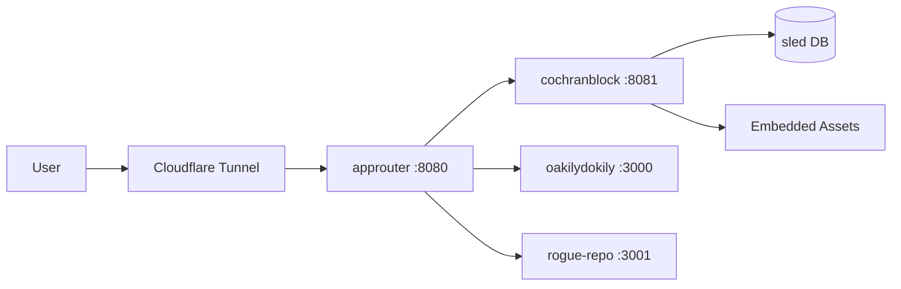
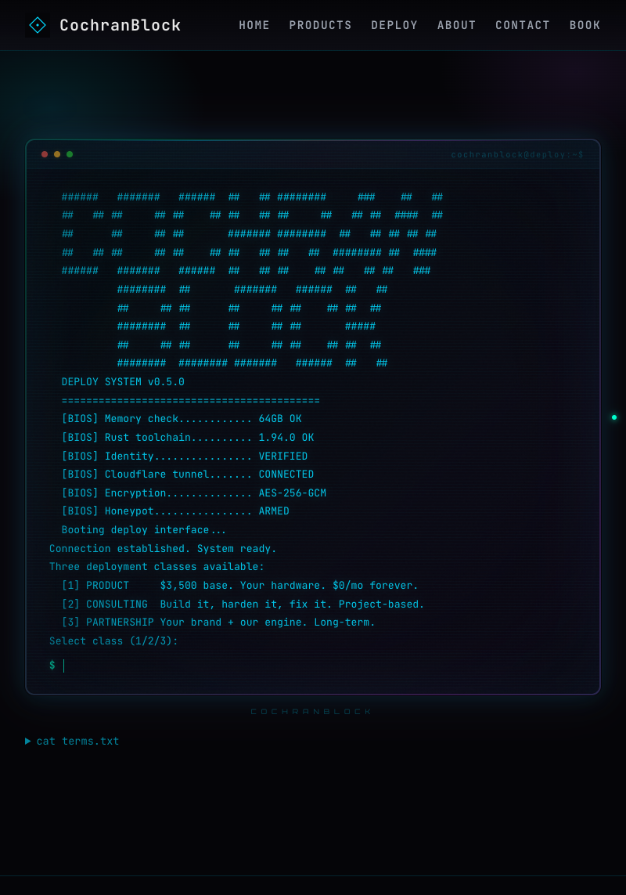

<!-- Unlicense — cochranblock.org -->

# Proof of Artifacts

*Visual and structural evidence that this project works, ships, and is real.*

> This is not a demo repo. This is production software. The artifacts below prove it.

## Architecture



## Build Output

| Metric | Value |
|--------|-------|
| Binary size (x86) | 18MB (release, stripped, LTO) |
| Binary size (ARM) | 9.9MB |
| Infrastructure cost | $10/month |
| External services | Cloudflare tunnel (free tier) |
| Database | Embedded sled + SQLite — no external DB |
| Cloud dependencies | Zero |
| Public repos | 11 (all Unlicense) |
| Certification | SDVOSB pending, SAM.gov registered, eMMA registered |

## Screenshots

| View | Artifact |
|------|----------|
| Homepage |  |
| Products |  |
| Deploy (Tech Intake) |  |
| About |  |
| Book a Call |  |

## How to Verify

```bash
# Clone, build, run. That's it.
cargo build --release -p cochranblock
ls -lh target/release/cochranblock   # <10MB
./target/release/cochranblock         # localhost:8081
```

---

*Part of the [CochranBlock](https://cochranblock.org) zero-cloud architecture. All source under the Unlicense.*
