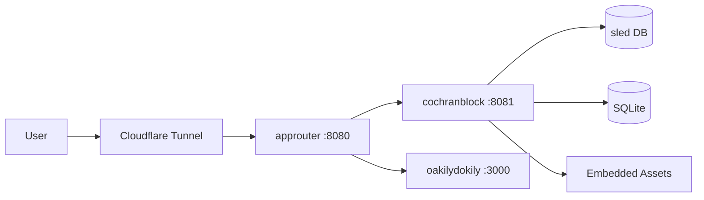

<!-- Unlicense — cochranblock.org -->

# Proof of Artifacts

*Visual and structural evidence that this project works, ships, and is real.*

> This is not a demo repo. This is production software. The artifacts below prove it.

## Architecture



## Build Output

| Metric | Value |
|--------|-------|
| Binary size (x86) | 15MB (release, opt-level='s', LTO, strip) |
| Binary size (ARM) | 8.4MB |
| Infrastructure cost | $10/month |
| External services | Cloudflare tunnel (free tier) |
| Database | Embedded sled + SQLite — no external DB |
| Cloud dependencies | Zero |
| Public repos | 15 (13 Unlicense, 2 proprietary) |
| Certification | SDVOSB pending · SAM.gov pending registration · eMMA vendor SUP1095449 · CSB approved |
| Functions | 92 |
| Types | 10 |
| Lines of code | 5,980 |
| Direct dependencies | 38 |
| Routes | 50 (45 production + 5 dev) |
| Release profile | opt-level='s', lto=true, codegen-units=1, panic='abort', strip=true |
| GPU nodes | lf: RTX 3070 8GB · gd: RTX 3050 Ti 4GB |
| QA Round 1 | PASS — zero errors, zero warnings, zero debug prints, zero AI slop, all routes 200 |
| QA Round 2 | PASS — clean build, clippy -D warnings, zero uncommitted changes |

## Screenshots

| View | Artifact |
|------|----------|
| Homepage |  |
| Products |  |
| Deploy (Tech Intake) |  |
| About |  |
| Book a Call |  |

## How to Verify

```bash
# Clone, build, run. That's it.
cargo build --release -p cochranblock --features approuter
ls -lh target/release/cochranblock   # <10MB
./target/release/cochranblock         # localhost:8081
```

---

*Part of the [CochranBlock](https://cochranblock.org) zero-cloud architecture. All source under the Unlicense.*
