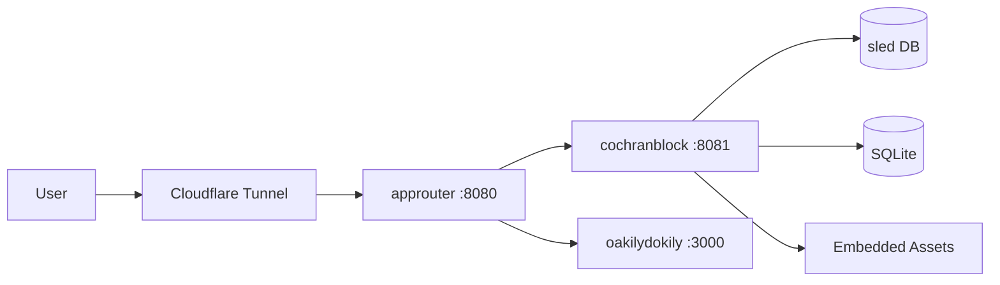

<!-- Unlicense — cochranblock.org -->

# Proof of Artifacts

*Visual and structural evidence that this project works, ships, and is real.*

> This is not a demo repo. This is production software. The artifacts below prove it.

## Architecture



## Build Output

| Metric | Value |
|--------|-------|
| Binary size (x86) | 9.9MB (release, opt-level='s', LTO, strip) |
| Binary size (ARM) | 8.4MB |
| Infrastructure cost | $10/month |
| External services | Cloudflare tunnel (free tier) |
| Database | Embedded sled + SQLite — no external DB |
| Cloud dependencies | Zero |
| Public repos | 15 (13 Unlicense, 2 proprietary) |
| crates.io | 4 published crates (kova-engine, exopack, any-gpu, header-writer) |
| Certification | SAM.gov Active · CAGE 1CQ66 · UEI W7X3HAQL9CF9 · SDVOSB pending · eMMA SUP1095449 · CSB approved |
| Functions | 122 |
| Types | 18 |
| Lines of code | 9,680 |
| Direct dependencies | 38 |
| Routes | 55 (50 production + 5 dev) |
| Release profile | opt-level='s', lto=true, codegen-units=1, panic='abort', strip=true |
| GPU nodes | lf: RTX 3070 8GB · gd: RTX 3050 Ti 4GB |
| Performance | TTFB 116ms · First paint 176ms · 72fps · CLS 0.0000 · 131 DOM elements |
| QA Round 1 | PASS — zero errors, zero warnings, zero debug prints, zero AI slop, all routes 200 |
| QA Round 2 | PASS — clean build, clippy -D warnings, zero uncommitted changes |

## Named Inventions & Techniques

| Name | Type | Project | Description |
|------|------|---------|-------------|
| Fish Tank Starfield | Invention | cochranblock | GPU-zero-cost starfield — static mask + background-position loop, 1/4 GPU memory |
| P13 Compression Mapping | Invention | kova | AI context tokenization — 75% context budget reduction, 368 symbols compressed |
| Triple Sims | Invention | exopack | Triple-deterministic test gate — pass identically 3x or fail |
| NanoSign | Invention | pixel-forge | 36-byte BLAKE3 model integrity — air-gapped, no infrastructure |
| Gemini Man Pattern | Invention | rogue-repo | Zero-downtime binary self-replacement via SO_REUSEPORT |
| Sponge Mesh Broadcast | Invention | kova/tmuxisfree | Rate-limit-aware retry mesh across 28 AI agent sessions |
| Self-Converging Flywheel | Invention | portfolio | 6-stage architecture reducing external AI dependency per cycle |
| MoE Cascade Pipeline | Technique | pixel-forge | Cinder → Quench → Anvil staged AI model pipeline |
| Ghost Fabric Edge Intelligence | Technique | cochranblock | Edge deployment cost model — Rust vs Python at scale |
| Negative Space Starfield | Technique | cochranblock | Static gradient mask with drifting light, compositor-only |
| Tokenized CLI Compression | Technique | kova | x0-x9, g0-g9, c1-c9 compressed command interface |

## Screenshots

| View | Artifact |
|------|----------|
| Homepage |  |
| Products |  |
| Deploy (Tech Intake) |  |
| About |  |
| Book a Call |  |

## How to Verify

```bash
# Clone, build, run. That's it.
cargo build --release -p cochranblock --features approuter
ls -lh target/release/cochranblock   # <10MB
./target/release/cochranblock         # localhost:8081
```

---

*Part of the [CochranBlock](https://cochranblock.org) zero-cloud architecture. All source under the Unlicense.*
