<!-- Unlicense — cochranblock.org -->

# Proof of Artifacts

*Visual and structural evidence that this project works, ships, and is real.*

> This is not a demo repo. This is production software. The artifacts below prove it.

## Architecture

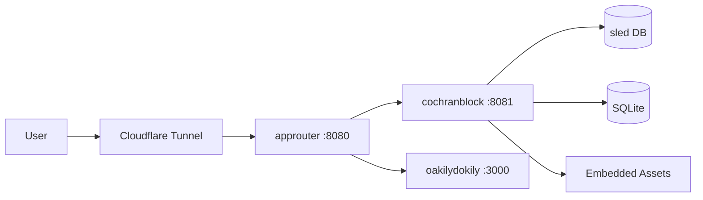

## Build Output

| Metric | Value |
|--------|-------|
| Binary size (x86) | 9.9MB (release, opt-level='s', LTO, strip) |
| Binary size (ARM) | 8.4MB |
| Infrastructure cost | $10/month |
| External services | Cloudflare tunnel (free tier) |
| Database | Embedded sled + SQLite — no external DB |
| Cloud dependencies | Zero |
| Public repos | 31 (Unlicense / public domain) |
| crates.io | 32 published crates (kova-engine, exopack, any-gpu, header-writer, +28) |
| Certification | SAM.gov Active · CAGE 1CQ66 · UEI W7X3HAQL9CF9 · SDVOSB Final Review (MySBA Certifications) · eMMA SUP1095449 · CSB approved · TS/SCI reactivation eligible · 30% service-connected disabled veteran |
| Functions | 122 |
| Types | 18 |
| Lines of code | 9,680 |
| Direct dependencies | 38 |
| Routes | 55 (50 production + 5 dev) |
| Release profile | opt-level='s', lto=true, codegen-units=1, panic='abort', strip=true |
| GPU nodes | lf: RTX 3070 8GB · gd: RTX 3050 Ti 4GB |
| Performance | TTFB 116ms · First paint 176ms · 72fps · CLS 0.0000 · 131 DOM elements |
| QA Round 1 | PASS — zero errors, zero warnings, zero debug prints, zero AI slop, all routes 200 |
| QA Round 2 | PASS — clean build, clippy -D warnings, zero uncommitted changes |

## Named Inventions & Techniques

| Name | Type | Project | Description |
|------|------|---------|-------------|
| Fish Tank Starfield | Invention | cochranblock | GPU-zero-cost starfield — static mask + background-position loop, 1/4 GPU memory |
| P13 Compression Mapping | Invention | kova | AI context tokenization — 75% context budget reduction, 368 symbols compressed |
| Triple Sims | Invention | exopack | Triple-deterministic test gate — pass identically 3x or fail |
| NanoSign | Invention | pixel-forge | 36-byte BLAKE3 model integrity — air-gapped, no infrastructure |
| Gemini Man Pattern | Invention | rogue-repo | Zero-downtime binary self-replacement via SO_REUSEPORT |
| Sponge Mesh Broadcast | Invention | kova/tmuxisfree | Rate-limit-aware retry mesh across 28 AI agent sessions |
| Self-Converging Flywheel | Invention | portfolio | 6-stage architecture reducing external AI dependency per cycle |
| MoE Cascade Pipeline | Technique | pixel-forge | Cinder → Quench → Anvil staged AI model pipeline |
| Ghost Fabric Edge Intelligence | Technique | cochranblock | Edge deployment cost model — Rust vs Python at scale |
| Negative Space Starfield | Technique | cochranblock | Static gradient mask with drifting light, compositor-only |
| Tokenized CLI Compression | Technique | kova | x0-x9, g0-g9, c1-c9 compressed command interface |
| Two-Act Manifesto Fold | Technique | cochranblock | Doctrine (Act I) + amber-rule seam + Operations (Act II) folded on a single scroll. Sticky TOC rail kicks in at the seam. Single asset, multiple deep-link anchors (`#doctrine`, `#manual`). |
| Trust-Chip Strip | Technique | cochranblock | Federal-credentials display restructured from inline `<br>`-separated text to flex-wrap atomic chips. Each credential (UEI, CAGE, EIN, SAM, SDVOSB, etc.) is its own self-contained pill that wraps cleanly without clipping at the viewport edge on mobile portrait. |
| HTML → PDF Render Pipeline | Technique | cochranblock | `chromium --headless --print-to-pdf` against the live `/resume` HTML (with `sed`-rewritten absolute URLs) generates `michael-cochran-resume_may_2026.pdf` from the same source the browser sees. Single source of truth for site + downloaded artifact. Print stylesheet hides topbar / pdf-nudge / backrefs / cosmic backdrop. |
| Multi-Viewport Screenshot Pipeline | Technique | cochranblock | `scripts/screenshots.sh` drives chromium-headless across phone-portrait (390×844), phone-landscape (844×390), tablet-portrait (768×1024), tablet-landscape (1024×768), and desktop (1280×800) for 5 pages. UI/UX simulation as a CI artifact. |
| AI Orchestration over Curated Data | Technique | cochranblock | Custom AI orchestration paired with researched and curated datasets — *data is the moat, not the model.* Multiple shipped instances. On-device inference for disconnected / cleared environments; no FedRAMP cloud auth required. |
| Hannah Montana Mode | Pattern (rejected) | cochranblock | Two-identity resume serving (ATS-clean default + anti-founder branded variant) explored under `/resume` + `/resume/doctrine`. Rejected after testing — single name-led resume with the doctrine demoted to footer reference is the better trade-off. The website itself does the doctrine work. |
| Native-Details Hamburger | Technique | cochranblock | CSS-only mobile nav using `<details class="nav-mobile">` + styled `<summary>` as the burger icon. `[open]` state morphs 3 stacked bars into an X via `:nth-child` transforms; drawer is the details body, fixed-positioned over the cosmic backdrop. Drawer content grouped into 4 labeled accordion-style sections (On This Page / Procurement / Receipts / Site) so the user navigates in buyer-journey order. Zero JavaScript. Renders identically across desktop, tablet, phone, and accessibility tools because it's native HTML semantics. |
| CDP-Driven Rendering Verification | Technique | cochranblock | Standalone Rust binary (`/tmp/burger-check/` + chromiumoxide 0.7) drives Chromium via the DevTools Protocol to *evaluate JS* against a loaded page, returning the actual computed DOM state (`display`, `visibility`, `bbox`, `z-index`, etc.) of any selector. Settles UI bugs that headless CLI screenshots can't — e.g. when `chromium --headless=new --screenshot` failed to capture a `position: fixed` hamburger overlaid on a cosmic-backdrop layer at small viewports, the CDP introspection proved the element was rendering at the correct coordinates with full opacity. Source of truth = computed style + CDP screenshot, not CLI screenshot. |

## Screenshots

*All `prod-*` captures below are from the live deployed site at `https://cochranblock.org`, taken via chromium-headless one at a time with 8s pacing to respect Cloudflare rate limits. Each was visually inspected after capture to confirm content + layout integrity per viewport. The `pics-or-it-didn't-happen` audit.*

### Legacy site (pre-2026-05-06)

| View | Artifact |
|------|----------|
| Homepage (legacy commercial hero — replaced by LET'S TEAM 2026-05-06) |  |
| Products |  |
| Deploy (Tech Intake) |  |
| About |  |
| Book a Call |  |

### Live production captures — 2026-05-06

| Page | Viewport | Artifact | Verified |
|------|----------|----------|----------|
| **Lets Team apex root** | desktop 1280×800 | 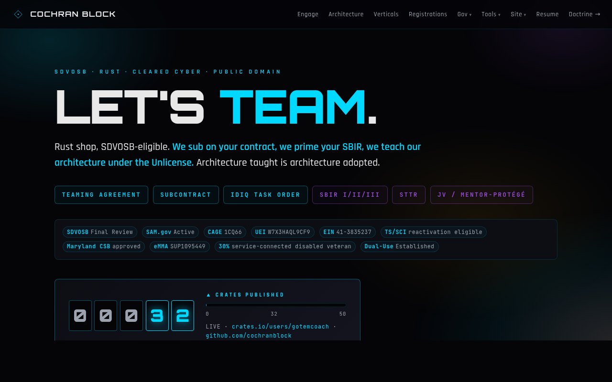 | Hero "LET'S TEAM." renders at full Orbitron 900; full nav with all 3 dropdowns (Gov / Tools / Site) + Resume link + Doctrine →; trust chips display all 10 credentials in 2 wrapping rows; speedometer 00032 with crates.io link |
| Lets Team apex root | tablet portrait 768×1024 | 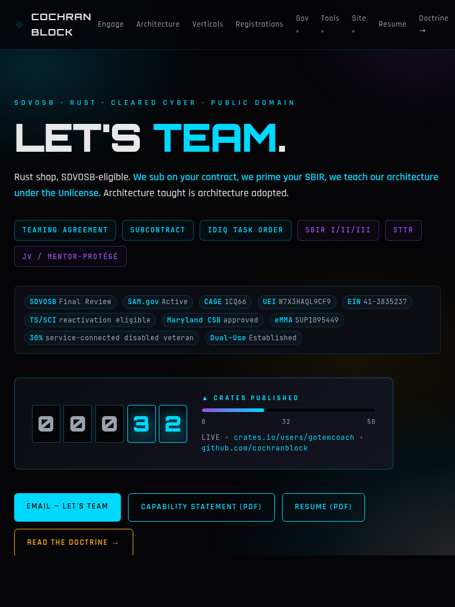 | Hero fits cleanly; pills wrap to 2 rows (3+3); trust chips wrap to 4 lines; CTAs (Email / Cap Stmt / Resume / Doctrine) all visible at fold |
| Lets Team apex root | tablet landscape 1024×768 | 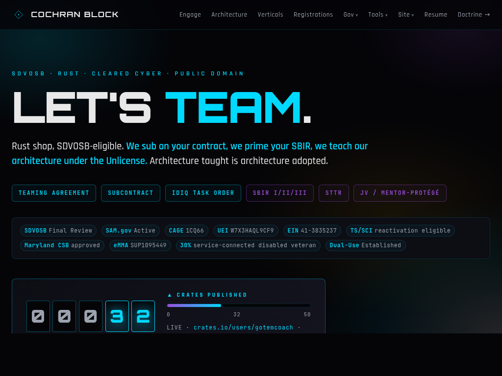 | Compressed tablet view, all critical elements above fold |
| **Lets Team apex root** | **phone portrait 390×844** | 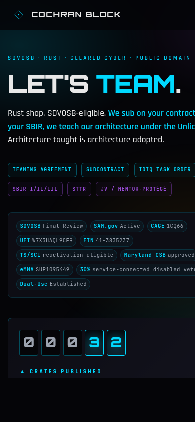 | **Mobile-portrait fix verified** — banner clamp(1.7rem,10vw,3.4rem) fits "LET'S TEAM." cleanly; trust strip flex-wrap chips render WITHOUT right-edge clipping (was the reported "weird box under JV/Mentor-Protégé" issue); 6 hero pills wrap 3+3 |
| Lets Team apex root | phone landscape 844×390 | 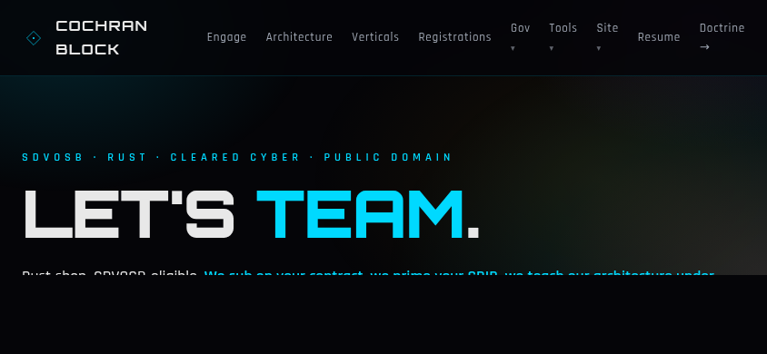 | Wide-but-short viewport, nav-row + hero |
| **Resume (MICHAEL COCHRAN)** | desktop 1280×800 | 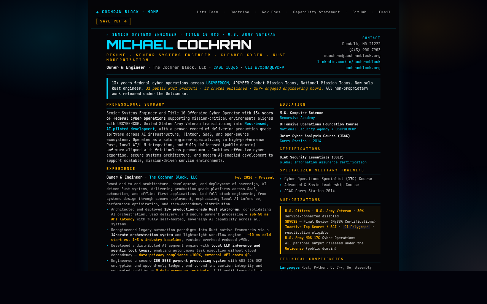 | Banner reads `MICHAEL COCHRAN` (cyan/white split) at Orbitron 26pt 900; cap-statement-styled letter doc rendered as a centered page on dark; right-side contact block with phone/email/LinkedIn/cochranblock.org; cosmic backdrop (screen-only) glowing |
| Resume | tablet portrait 768×1024 | 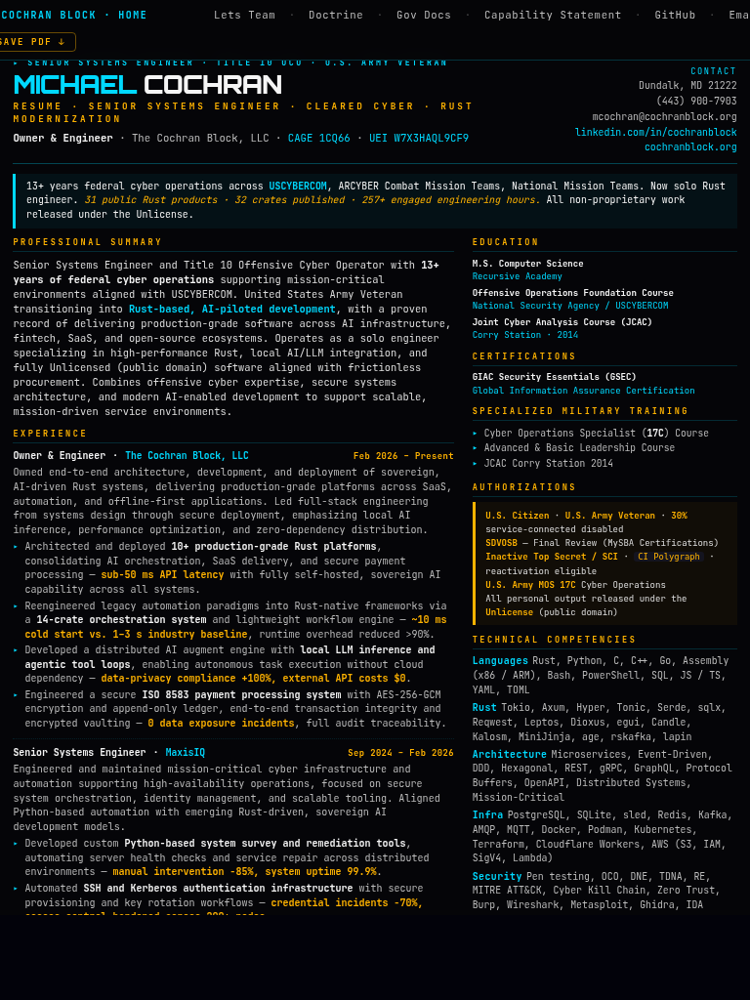 | Tightened 8.4pt typography + larger banner; full content visible; cosmic backdrop |
| Resume | phone portrait 390×844 | 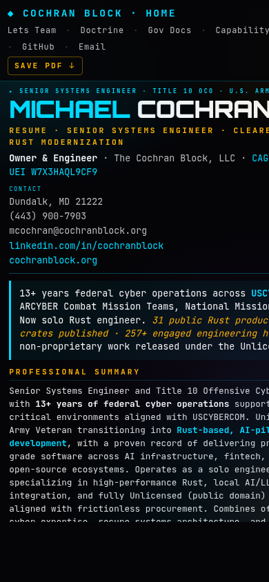 | Single-column 10pt for screen readability; sticky topbar (Lets Team / Doctrine / Gov Docs / Capability Statement / GitHub / Email + Save PDF button); MICHAEL COCHRAN banner sized for phone; no horizontal overflow |
| **Folded Manual (Act I Doctrine)** | desktop 1280×800 | 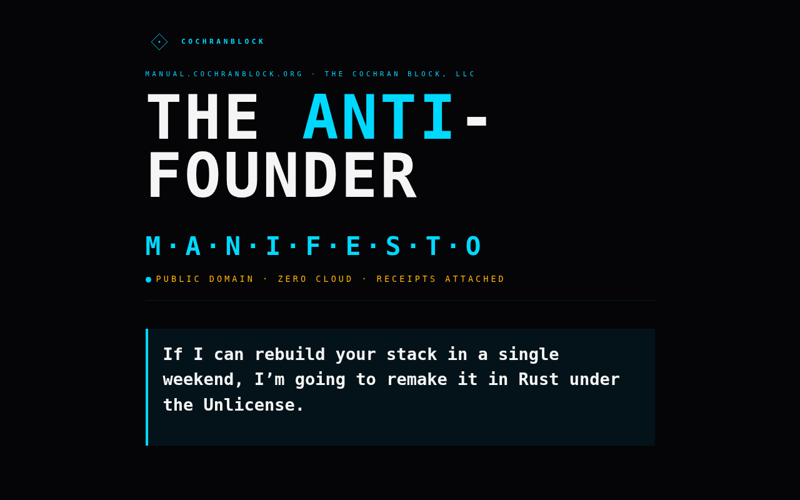 | "THE ANTI-FOUNDER" Orbitron banner at top of folded asset, "M·A·N·I·F·E·S·T·O" subtitle, "PUBLIC DOMAIN · ZERO CLOUD · RECEIPTS ATTACHED" pretag, doctrine creed in cyan-bordered block |
| Folded Manual | tablet portrait 768×1024 | 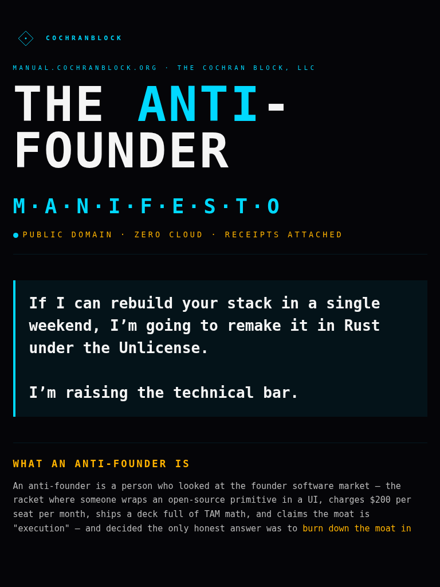 | Banner wraps to 2 lines; creed visible; "WHAT AN ANTI-FOUNDER IS" section heading at fold |
| Folded Manual | phone portrait 390×844 | 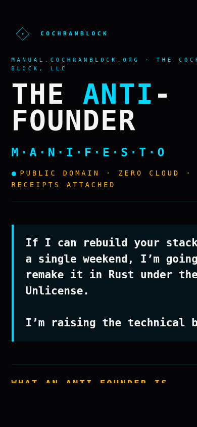 | Same Act I content scaled for phone; banner THE ANTI-FOUNDER on 2 lines; doctrine creed visible |
| Govdocs (procurement) | desktop 1280×800 | 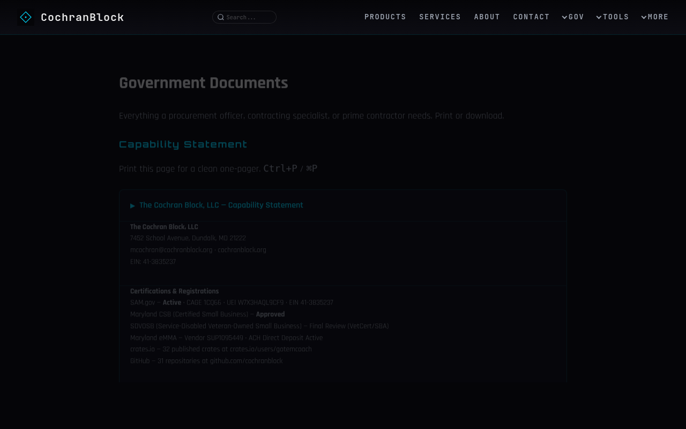 | Standard C7 nav (Products / Services / About / Contact / ▾Gov / ▾Tools / ▾More); "Government Documents" h1; Capability Statement details; SDVOSB **Final Review (VetCert/SBA)**; 32 crates · 31 repos; cosmic backdrop |
| Services | desktop 1280×800 | 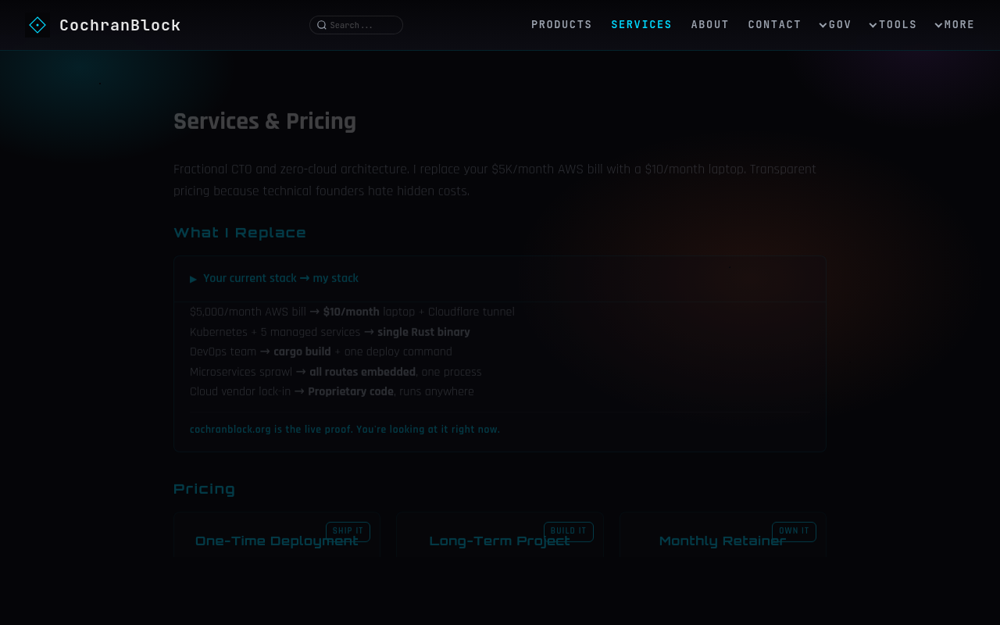 | Standard nav; "Services & Pricing"; "What I Replace" comparison block; cosmic backdrop with the orange-tinted services-page ambient gradient (per `body[data-page="services"]::after`); 3-card pricing row at bottom |
| **Mobile hamburger — closed** | iPhone 390×844 (CDP) | 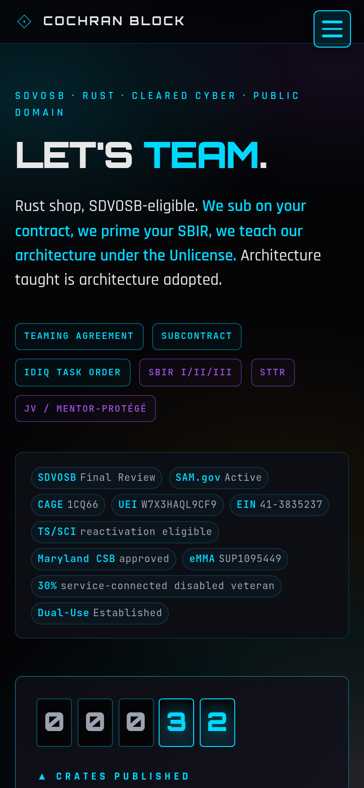 | Captured via chromiumoxide DevTools Protocol with iOS Safari UA + mobile=true emulation. 40×40 cyan-bordered ☰ button at top-right (x=335.6, y=11.2). Three horizontal bars visible inside. Brand "COCHRAN BLOCK" left-aligned. CDP-verified computed style: `display:block · position:fixed · z-index:100 · visibility:visible · opacity:1`. |
| **Mobile hamburger — open** | iPhone 390×844 (CDP) | 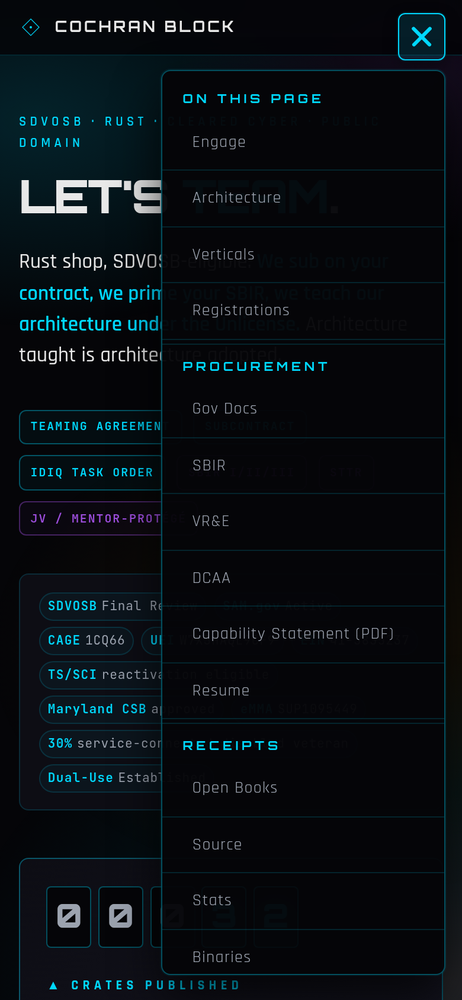 | Same viewport after programmatic click on summary. Bars morph into ✕ (cyan X). Drawer expands below with 4-group accordion: ON THIS PAGE (Engage / Architecture / Verticals / Registrations) · PROCUREMENT (Gov Docs / SBIR / VR&E / DCAA / Capability Statement / Resume) · RECEIPTS (Open Books / Source / Stats / Binaries) · SITE. 25 menu items total. Cyan group headings in Orbitron, item links monospace. Backdrop blur preserves cosmic-layer through the drawer. |

## How to Verify

```bash
# Clone, build, run. That's it.
cargo build --release -p cochranblock --features approuter
ls -lh target/release/cochranblock   # ~16MB (the binary now embeds 2 PDFs + folded manual + lets-team + capability statement HTML/PDF)
./target/release/cochranblock         # localhost:8081
```

## Multi-Viewport UI/UX Simulation

```bash
# Build, restart, capture 25 screenshots across phone / tablet / desktop
cargo build --release -p cochranblock --features approuter
./target/release/cochranblock &
bash scripts/screenshots.sh http://192.168.1.52:8081
ls -1 screenshots/prod-*.png
```

## HTML → PDF Resume Render

```bash
# Generate the downloadable resume PDF directly from the served /resume HTML
bash scripts/build-resume-pdf.sh
ls -lh assets/michael-cochran-resume_may_2026.pdf  # ~290 KB, 2 pages, letter format
cargo build --release -p cochranblock --features approuter  # re-embed into binary
```

---

*Part of the [CochranBlock](https://cochranblock.org) zero-cloud architecture. All source under the Unlicense.*
<!-- COCHRANBLOCK-BRAND-FOOTER:START - generated by cochranblock/scripts/brand-stamp.sh -->

---

<sub>&#9656; **THE COCHRAN BLOCK, LLC** &#183; CAGE `1CQ66` &#183; UEI `W7X3HAQL9CF9` &#183; UNLICENSE &#183; [cochranblock.org](https://cochranblock.org)</sub>
<!-- COCHRANBLOCK-BRAND-FOOTER:END -->
