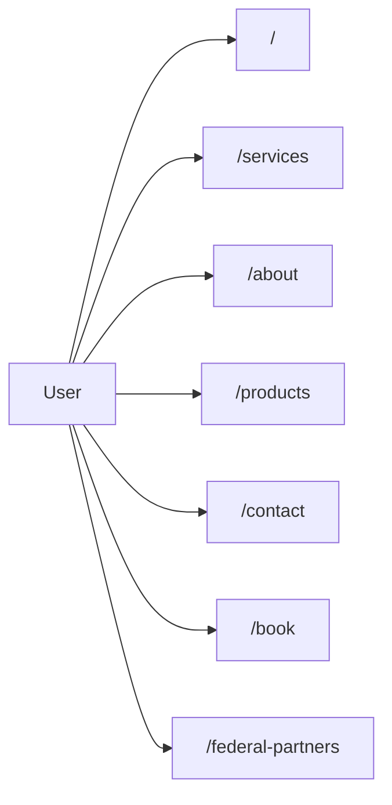

<!-- Unlicense — cochranblock.org -->
<!-- Contributors: Mattbusel (XFactor), GotEmCoach, KOVA, Claude Opus 4.6, SuperNinja, Composer 1.5, Google Gemini Pro 3 -->

> **It's not the Mech — it's the pilot.**
>
> This repo is part of [CochranBlock](https://cochranblock.org) — 11 Unlicense Rust repositories that power an entire company on a **single 9.9MB binary** (ARM), a laptop, and a **$10/month** Cloudflare tunnel. No AWS. No Kubernetes. No six-figure DevOps team. Zero cloud.
>
> **[cochranblock.org](https://cochranblock.org)** is a live demo of this architecture. You're welcome to read every line of source code — it's all public domain.
>
> Every repo ships with **[Proof of Artifacts](PROOF_OF_ARTIFACTS.md)** (wire diagrams, screenshots, and build output proving the work is real) and a **[Timeline of Invention](TIMELINE_OF_INVENTION.md)** (dated commit-level record of what was built, when, and why — proving human-piloted AI development, not generated spaghetti).
>
> **Looking to cut your server bill by 90%?** → [Zero-Cloud Tech Intake Form](https://cochranblock.org/deploy)

---

<p align="center">
  
</p>

# cochranblock

## Proof of Artifacts

*Wire diagrams, screenshots, and demos for quick review.*

### Wire / Architecture



### Screenshots

| View | Description |
|------|-------------|
|  | Hero section |
|  | Products page |
|  | Rogue Repo (Products) |
|  | Kova (Products) |
|  | Ronin Sites (Products) |
|  | Services page |

### Demo

*Add `docs/artifacts/demo-hero.gif` for hero scroll or Products carousel.*

---

CochranBlock site (cochranblock.org) — Rust Axum server with embedded assets.

## Run

```bash
cargo run -p cochranblock
```

Then open http://localhost:8081 (default). Routes: `/`, `/services`, `/mathskillz`, `/about`, `/contact`, `/book`, `/products`, `/deploy`, `/downloads`, `/community-grant`.

## Tokenization

The source code uses **compact identifiers** (f0, t15, s0, etc.) per the Token-Optimized Code Representation whitepaper. See [../kova/docs/TOKENIZATION_IMPLEMENTATION.md](../kova/docs/TOKENIZATION_IMPLEMENTATION.md) and [../kova/docs/compression_map.md](../kova/docs/compression_map.md).

## Docs

- [docs/architecture_guide.md](docs/architecture_guide.md) — Full architecture
- [exopack/docs/testing_architecture.md](../exopack/docs/testing_architecture.md) — Two-binary test model
- [content/whitepaper_text.txt](content/whitepaper_text.txt) — Tokenization whitepaper