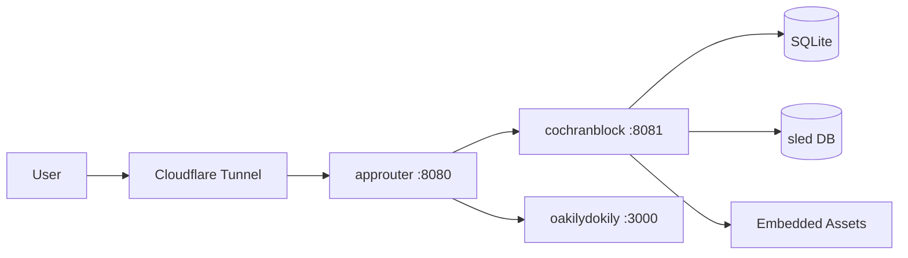
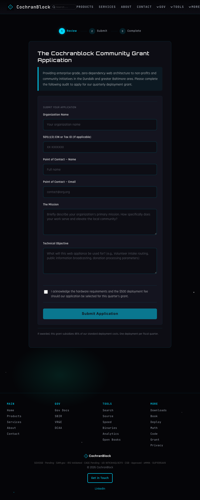

<!-- Unlicense — cochranblock.org -->
<!-- Contributors: Mattbusel (XFactor), GotEmCoach, KOVA, Claude Opus 4.6, SuperNinja, Composer 1.5, Google Gemini Pro 3 -->

> **It's not the Mech — it's the pilot.**
>
> This repo is part of [CochranBlock](https://cochranblock.org) — open source Rust repositories that power an entire company on a **single binary**, a laptop, and **$10/month** infrastructure. No AWS. No Kubernetes. No six-figure DevOps team. Zero cloud.
>
> **[cochranblock.org](https://cochranblock.org)** is a live demo of this architecture. You're welcome to read every line of source code — it's all public domain.
>
> Every repo ships with **[Proof of Artifacts](PROOF_OF_ARTIFACTS.md)** (wire diagrams, screenshots, and build output proving the work is real) and a **[Timeline of Invention](TIMELINE_OF_INVENTION.md)** (dated commit-level record of what was built, when, and why — proving human-piloted AI development, not generated spaghetti).
>
> **Looking to cut your server bill by 90%?** → [Zero-Cloud Tech Intake Form](https://cochranblock.org/deploy)

---

<p align="center">
  
</p>

# cochranblock

The cochranblock.org website — Rust Axum server with embedded assets, SQLite intake forms, sled key-value store, booking calendar, and community grant application. Compiles to a single binary (8.4 MB ARM, 15 MB x86) with zero external dependencies at runtime.

## Architecture



## Build & Run

```bash
cargo build --release -p cochranblock --features approuter
./target/release/cochranblock   # localhost:8081
```

## Test

```bash
cargo run -p cochranblock --bin cochranblock-test --features tests
```

Runs unit, integration, and HTTP tests three times (TRIPLE SIMS gate) with screenshot capture via [exopack](https://github.com/cochranblock/exopack).

## Routes

| Route | What |
|-------|------|
| `/` | Home — hero, pitch, live stats, CTAs |
| `/products` | Product catalog — platforms, partnerships, open source |
| `/services` | Pricing and service offerings |
| `/deploy` | Tech intake form (SQLite-backed) |
| `/deploy/confirmed` | Submission confirmation |
| `/book` | Discovery call booking calendar |
| `/about` | Mission, credentials, testimonials |
| `/contact` | Email CTA |
| `/community-grant` | Community grant application form |
| `/community-grant/confirmed` | Grant submission confirmation |
| `/downloads` | Resume PDF, logo card |
| `/codeskillz` | Live velocity tracking for repos |
| `/mathskillz` | Cost analysis: cloud vs zero-cloud |
| `/govdocs` | Capability statement, SBIR proposals, bid tracker |
| `/sbir` | SBIR/provenance documentation |
| `/provenance` | AI development documentation framework |
| `/vre` | VR&E Chapter 31 self-employment track |
| `/tinybinaries` | Binary size comparison across repos |
| `/source` | Live source code of the running server |
| `/search` | Site search |
| `/speed` | Performance metrics |
| `/openbooks` | Open books financial transparency |
| `/dcaa` | DCAA-ready accounting (alias for /openbooks) |
| `/analytics` | Site analytics dashboard |
| `/privacy` | Privacy policy |
| `/health` | Health check endpoint |
| `/robots.txt` | Crawler directives |
| `/sitemap.xml` | Search engine sitemap |
| `/llms.txt` | AI crawler context |
| `/llms-full.txt` | Extended AI crawler context |
| `/humans.txt` | Team, tools, tech stack |
| `/.well-known/security.txt` | RFC 9116 security contact |
| `/api/stats` | Repo count stats |
| `/api/velocity` | GitHub velocity data |
| `/api/analytics` | Analytics data |
| `/api/site-stats` | Site statistics |
| `/api/openbooks` | Open books data |
| `/api/summary` | Site summary |

## Screenshots

| View | Artifact |
|------|----------|
| Homepage |  |
| Products |  |
| Deploy |  |
| About |  |
| Book a Call |  |
| Contact |  |
| Community Grant |  |

## Code Style

Source uses compact identifiers (f2, t0, C7, etc.) per the Token-Optimized Code Representation system. See the [kova compression map](https://github.com/cochranblock/kova) for the canonical mapping.

## Docs

- [docs/architecture_guide.md](docs/architecture_guide.md) — Full architecture reference
- [docs/TEST_WALKTHROUGH.md](docs/TEST_WALKTHROUGH.md) — Test binary walkthrough
- [PROOF_OF_ARTIFACTS.md](PROOF_OF_ARTIFACTS.md) — Visual evidence this is real
- [TIMELINE_OF_INVENTION.md](TIMELINE_OF_INVENTION.md) — Dated commit-level build record

## Dependencies

Products marked "Coming Soon" on the site depend on other repos:

| Product | Waiting On |
|---------|-----------|
| [Rogue Repo](https://github.com/cochranblock/rogue-repo) | rogue-repo, approuter |
| Ronin Sites | rogue-repo, approuter |
| Pocket Server | approuter, kova |
| [Ghost Fabric](https://github.com/cochranblock/ghost-fabric) | kova |

---

Part of the [CochranBlock](https://cochranblock.org) zero-cloud architecture. [See all products →](https://cochranblock.org/products)
