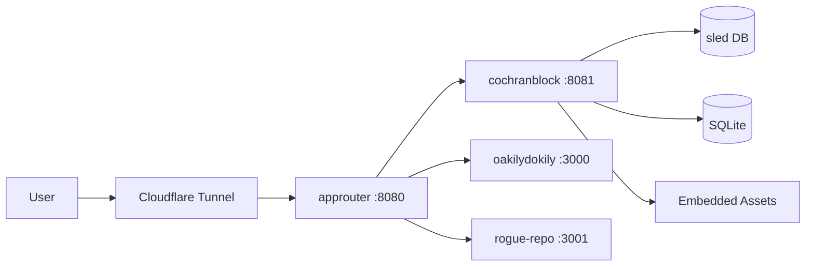

<!-- Unlicense — cochranblock.org -->
<!-- Contributors: Mattbusel (XFactor), GotEmCoach, KOVA, Claude Opus 4.6, SuperNinja, Composer 1.5, Google Gemini Pro 3 -->

> **It's not the Mech — it's the pilot.**
>
> This repo is part of [CochranBlock](https://cochranblock.org) — 14 Unlicense Rust repositories that power an entire company on a **single 18MB binary** (x86) / **9.9MB** (ARM), a laptop, and **$10/month** infrastructure. No AWS. No Kubernetes. No six-figure DevOps team. Zero cloud.
>
> **[cochranblock.org](https://cochranblock.org)** is a live demo of this architecture. You're welcome to read every line of source code — it's all public domain.
>
> Every repo ships with **[Proof of Artifacts](PROOF_OF_ARTIFACTS.md)** (wire diagrams, screenshots, and build output proving the work is real) and a **[Timeline of Invention](TIMELINE_OF_INVENTION.md)** (dated commit-level record of what was built, when, and why — proving human-piloted AI development, not generated spaghetti).
>
> **Looking to cut your server bill by 90%?** → [Zero-Cloud Tech Intake Form](https://cochranblock.org/deploy)

---

<p align="center">
  
</p>

# cochranblock

The cochranblock.org website — Rust Axum server with embedded assets, SQLite intake forms, booking calendar, and community grant application. Compiles to a single binary with zero external dependencies at runtime.

## Architecture



## Build & Run

```bash
cargo build --release -p cochranblock --features approuter
./target/release/cochranblock   # localhost:8081
```

## Routes

| Route | What |
|-------|------|
| `/` | Home — hero, pitch, CTAs |
| `/services` | Pricing and service offerings |
| `/products` | All 14 products |
| `/deploy` | Tech intake form (SQLite-backed) |
| `/deploy/confirmed` | Submission confirmation + rocket launch |
| `/book` | Discovery call booking calendar |
| `/about` | Mission, credentials, testimonials |
| `/contact` | Email CTA |
| `/codeskillz` | Live velocity tracking for 14 repos |
| `/mathskillz` | Cost analysis: cloud vs zero-cloud |
| `/govdocs` | Capability statement, SBIR proposals, bid tracker |
| `/sbir` | SBIR/provenance documentation |
| `/provenance` | AI development documentation framework |
| `/downloads` | Resume PDF, logo card |
| `/community-grant` | Community grant application form |
| `/robots.txt` | Crawler directives |
| `/sitemap.xml` | Search engine sitemap |
| `/llms.txt` | AI crawler context |
| `/.well-known/security.txt` | RFC 9116 security contact |
| `/humans.txt` | Team, tools, tech stack |
| `/health` | Health check endpoint |
| `/api/stats` | Repo count stats |
| `/api/velocity` | GitHub velocity data |

## Screenshots

| View | Artifact |
|------|----------|
| Homepage |  |
| Products |  |
| Deploy |  |
| About |  |
| Book a Call |  |
| Contact |  |
| Community Grant |  |

## Code Style

Source uses compact identifiers (f2, t0, C7, etc.) per the Token-Optimized Code Representation system. See the [kova compression map](https://github.com/cochranblock/kova) for the canonical mapping.

## Docs

- [docs/architecture_guide.md](docs/architecture_guide.md) — Full architecture reference
- [PROOF_OF_ARTIFACTS.md](PROOF_OF_ARTIFACTS.md) — Visual evidence this is real
- [TIMELINE_OF_INVENTION.md](TIMELINE_OF_INVENTION.md) — Dated commit-level build record

---

Part of the [CochranBlock](https://cochranblock.org) zero-cloud architecture. 14 Unlicense repos. [See all products →](https://cochranblock.org/products)
