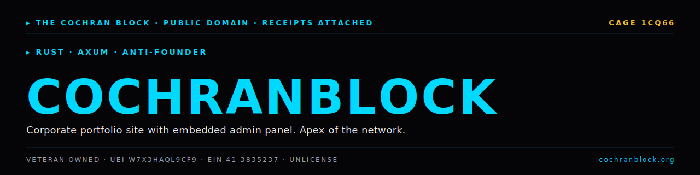
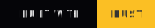

<!-- COCHRANBLOCK-BRAND-HEADER:START - generated by cochranblock/scripts/brand-stamp.sh -->
<picture>
  <source media="(prefers-color-scheme: dark)" srcset="assets/brand/banner.svg">
  <source media="(prefers-color-scheme: light)" srcset="assets/brand/banner.svg">
  
</picture>

[](https://unlicense.org)
[](https://www.rust-lang.org)
[](https://cochranblock.org)
[](https://cochranblock.org)

> &#9656; **RUST** &#183; **AXUM** &#183; **ANTI-FOUNDER**
<!-- COCHRANBLOCK-BRAND-HEADER:END -->

<p align="center">
  
</p>

# cochranblock

**Rust Axum server powering [cochranblock.org](https://cochranblock.org) — single binary, embedded assets, zero cloud.**

The cochranblock.org website. Compiles to one binary (~8.9 MB ARM, ~13 MB x86) with embedded assets, redb single-file ACID store, booking calendar, and community grant application baked in. $10/month infrastructure. No AWS. No Kubernetes.

---

## Documentation

This README is the entry point. The actual docs live in two source-of-truth files at the root of the repo:

- **[PROOF_OF_ARTIFACTS.md](PROOF_OF_ARTIFACTS.md)** — what exists today, status, source-linked. Build output, route table, named inventions, screenshots across viewports, quick start, dependencies on sibling repos. If you want to know what this project *does*, read this.
- **[TIMELINE_OF_INVENTION.md](TIMELINE_OF_INVENTION.md)** — dated, commit-level record of what was built, when, and why. If you want to know how this project *got built*, read this.

Supporting docs:
- [BACKLOG.md](BACKLOG.md) — prioritized open work
- [CONTRIBUTORS.md](CONTRIBUTORS.md) — contributor list
- [docs/architecture_guide.md](docs/architecture_guide.md) — full architecture reference
- [docs/TEST_WALKTHROUGH.md](docs/TEST_WALKTHROUGH.md) — test binary walkthrough

---

## Run It

```bash
cargo build --release -p cochranblock --features approuter
./target/release/cochranblock                                    # localhost:8081
cargo run -p cochranblock --bin cochranblock-test --features tests  # TRIPLE SIMS test gate
```

Full build, test, and route list in [PROOF_OF_ARTIFACTS.md → Quick Start](PROOF_OF_ARTIFACTS.md#quick-start).

---

## License

Unlicense (public domain). See [LICENSE](LICENSE).

Part of the [CochranBlock](https://cochranblock.org) zero-cloud architecture. [See all products →](https://cochranblock.org/products)
<!-- COCHRANBLOCK-BRAND-FOOTER:START - generated by cochranblock/scripts/brand-stamp.sh -->

---

<sub>&#9656; **THE COCHRAN BLOCK, LLC** &#183; Veteran-Owned &#183; **CAGE** `1CQ66` &#183; **UEI** `W7X3HAQL9CF9` &#183; **EIN** `41-3835237`</sub>

<sub>&#9656; PUBLIC DOMAIN &#183; UNLICENSE &#183; RECEIPTS ATTACHED &#183; [**cochranblock.org**](https://cochranblock.org) &#183; [github.com/cochranblock](https://github.com/cochranblock)</sub>
<!-- COCHRANBLOCK-BRAND-FOOTER:END -->
