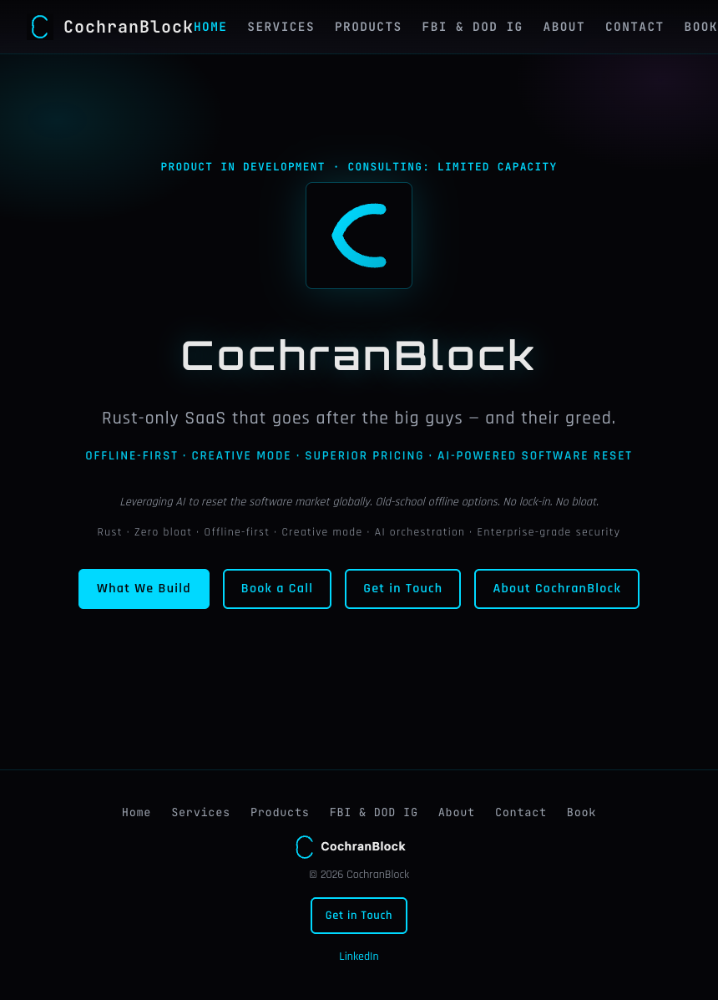
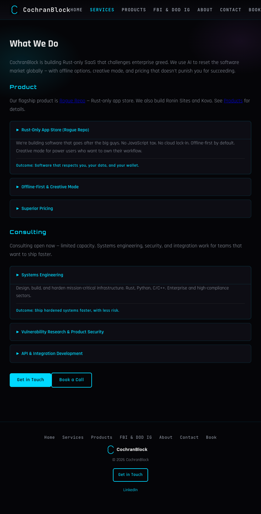
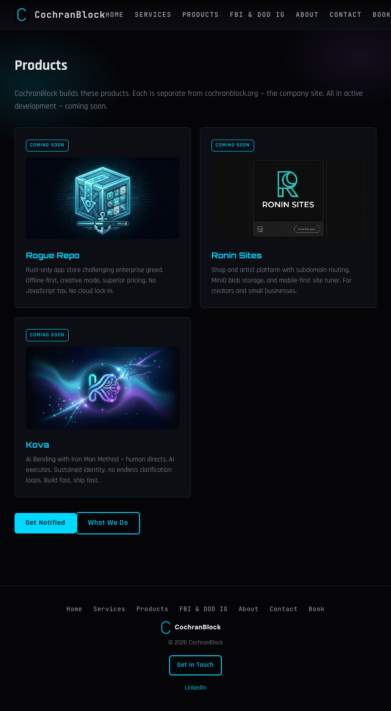
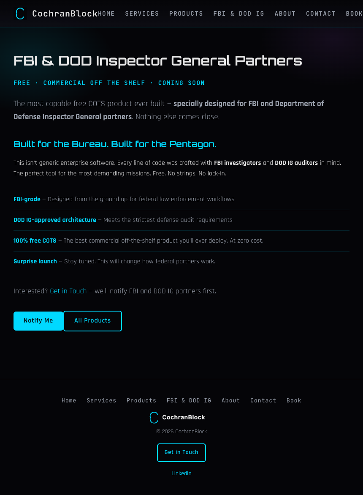
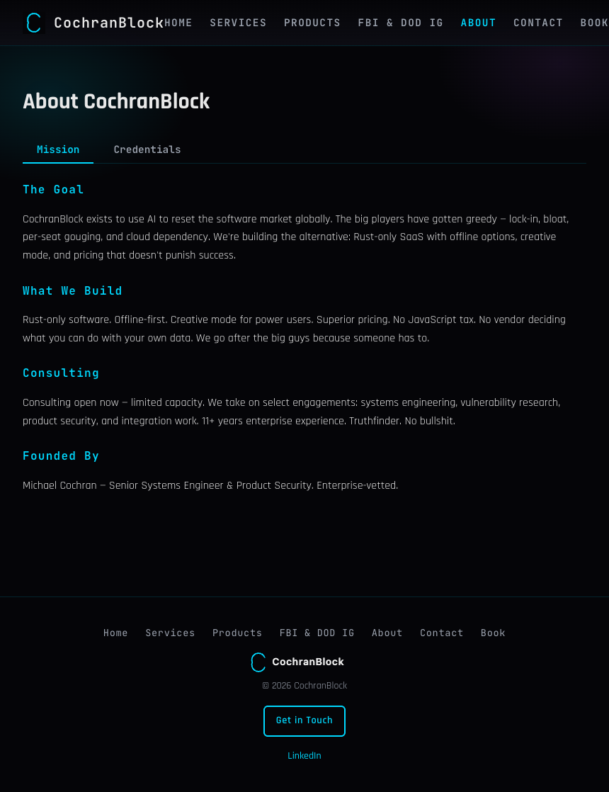
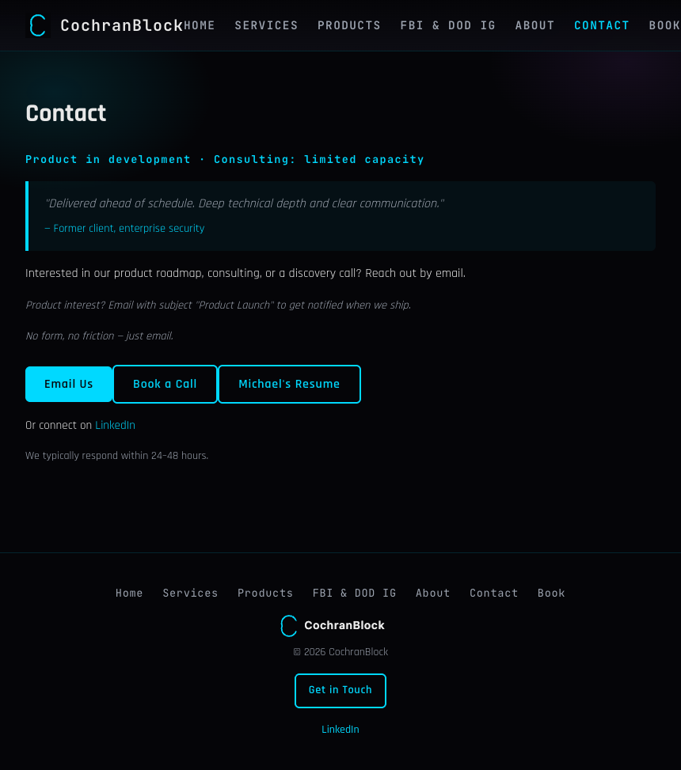
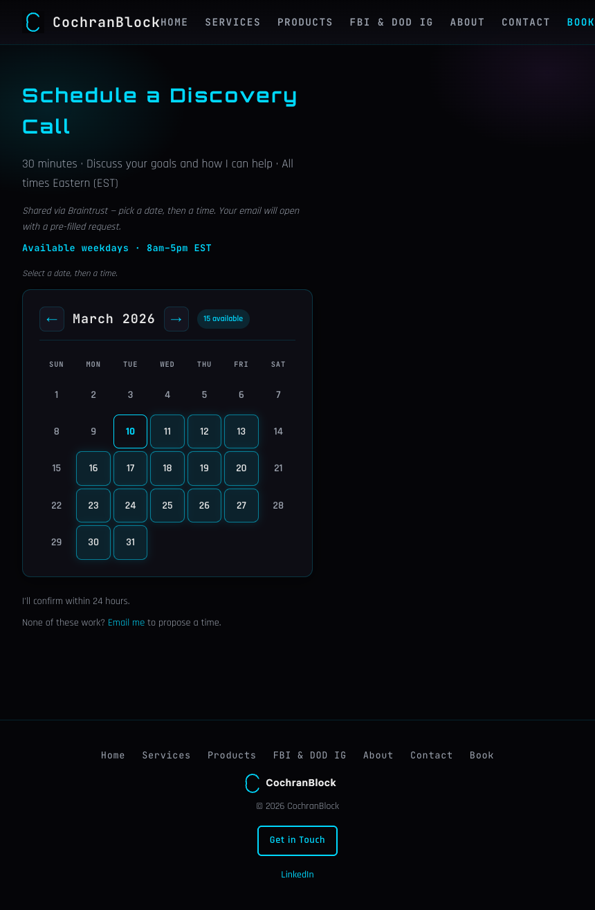

<!-- Copyright (c) 2026 The Cochran Block. All rights reserved. -->
# TRIPLE SIMS Test Coverage Stat

**Method:** Sequential analysis (User Story → Feature Gap → UI/UX)  
**Date:** 2026-02-27  
**Command:** `cargo run -p cochranblock --bin cochranblock-test --no-default-features --features tests -- --test`

---

## Test Counts

| Phase | Count | Description |
|-------|-------|-------------|
| Unit (f49) | 20 | Core crate: crypto, password, session, config, error, dns |
| Integration (f50) | 12 | Real SQLite, admin/session/settings/dns_log |
| HTTP (f51) | 49 | Real server, real requests, real content |
| **Total** | **81** | |

---

## Screenshot Capture

| Site | Binary | Pages | Output |
|------|--------|-------|--------|
| cochranblock.org | cochranblock | 7 | index, services, products, federal-partners, about, contact, book |
| **Total** | | **7** | `screenshots/` (repo) + `~/.cache/screenshots/{os}/cochranblock/` |

Screenshots are copied to `screenshots/` for TRIPLE SIMS visual evidence. See Sim 4 in each TRIPLE_SIMS_*.md.

| Page | Screenshot |
|------|------------|
| Home |  |
| Services |  |
| Products |  |
| Federal Partners |  |
| About |  |
| Contact |  |
| Book |  |

---

## TRIPLE SIMS Mapping

### Sim 1: User Story (HTTP tests)

| User Story | Test(s) |
|------------|---------|
| US1: Customer understands product value | index_tagline, services_product_details, index_business |
| US2: Consulting prospect finds offering | services_consulting_open, services_consulting_details, about_tabs |
| US3: Investor evaluates market position | about_founded_by, index_tagline |
| US4: Visitor books or contacts | book_200, contact_links, home_ctas, nav_footer_links |
| US5: Product launch status clarity | hero_product_status, products_all_coming_soon |
| US6: Product waitlist CTA | contact_product_launch_cta, products_all_coming_soon |

### Sim 2: Feature Gap (HTTP tests)

| Criterion | Test(s) |
|-----------|---------|
| Product status line | hero_product_status |
| Consulting availability | services_consulting_open |
| Product waitlist | contact_product_launch_cta |
| Founder line | about_founded_by |
| Products page | products_200, products_all_coming_soon, products_services_link |
| Product external links | products_roguerepo_link, products_ronin_link |

### Sim 3: UI/UX (HTTP tests)

| Criterion | Test(s) |
|-----------|---------|
| Semantic HTML (main, nav) | semantic_main_nav |
| Skip link (a11y) | semantic_main_nav |
| DOCTYPE | html_doctype |
| Viewport (mobile) | meta_viewport |
| Nav/footer links | nav_footer_links, home_ctas |

### Sim 4: Imagery Evaluation (screenshots)

| Criterion | Test(s) | Screenshot |
|-----------|---------|------------|
| Product images 200 | product_images_200 | [products](../screenshots/products.png) |
| Products list Rogue Repo, Ronin, Kova | products_200, products_all_coming_soon | [products](../screenshots/products.png) |
| Logo/favicon valid SVG | logo_svg, favicon_svg | [index](../screenshots/index.png) |
| Hero, Services, About, Contact, Book | — | [index](../screenshots/index.png), [services](../screenshots/services.png), [about](../screenshots/about.png), [contact](../screenshots/contact.png), [book](../screenshots/book.png) |

---

## Anti-Pattern Compliance

**No self-licking ice cream cones.** Every test validates:

- **Unit:** Real crypto round-trip, real password verify, real session lifecycle, real config
- **Integration:** Real SQLite, real queries, real persistence
- **HTTP:** Real server, real HTTP requests, real page content (status, body, headers)

No tests of: test framework internals, TempDir behavior, assertion wrappers, mocks for mock's sake.

---

## Run

```bash
PORTFOLIO_MASTER_KEY="test-key-32-bytes!!!!!!!!" cargo run -p cochranblock --bin cochranblock-test --no-default-features --features tests -- --test
```

Exit 0 = all pass. Screenshots written to `~/.cache/screenshots/{os}/cochranblock/` and copied to `screenshots/` for TRIPLE SIMS docs.
