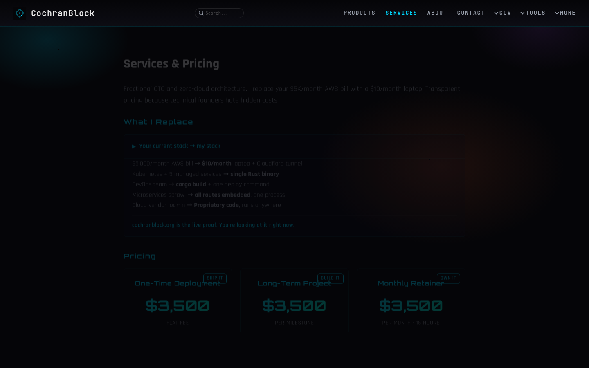
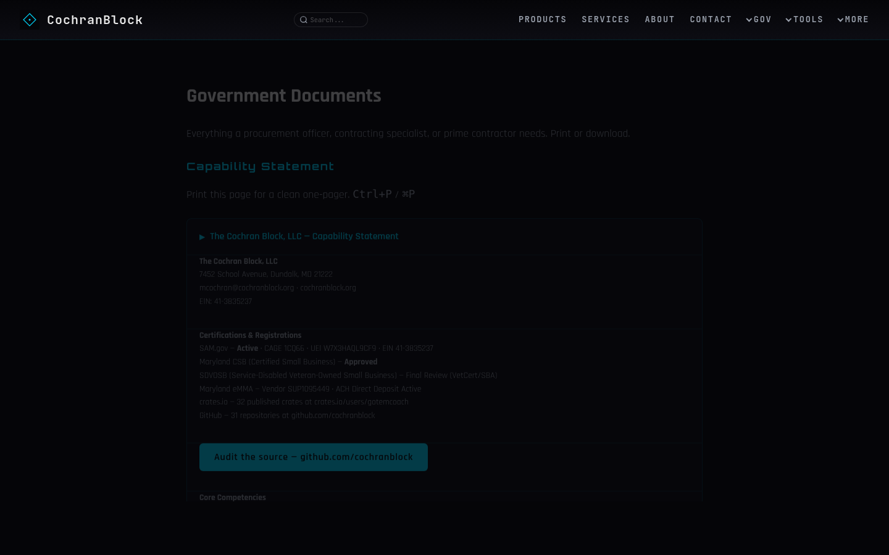

# Routes

190 total routes including aliases and redirects. Core content routes:

| Route | Handler | What |
|-------|---------|------|
| `/` | `f2_root` (subdomain dispatch) | LET'S TEAM apex or subdomain |
| `/products` | `f67` | Product catalog |
| `/services` | `f11` | Pricing and services |
| `/deploy` | `intake::get_form` | Tech intake form |
| `/deploy/confirmed` | `intake::confirmed` | Submission confirmation |
| `/about` | `f12` | Mission and credentials |
| `/contact` | `f13` | Email CTA |
| `/book` | `booking::get_form` | Discovery call booking |
| `/downloads` | `f68` | Resume PDF, logo card |
| `/codeskillz` | `f76` | Live repo velocity |
| `/stats` | `f97` | Performance + cost math + traffic |
| `/govdocs` | `f77` | Capability statement, SBIR, bid tracker |
| `/sbir` | `f74` | SBIR/provenance documentation |
| `/provenance` | `f74` | AI development documentation framework |
| `/vre` | `f82` | VR&E Chapter 31 self-employment track |
| `/tinybinaries` | `f81` | Binary size leaderboard |
| `/source` | `f83` | Live source code of the running server |
| `/search` | `f84` | Native full-text site search |
| `/sovereignty` | `f103` | Proof-of-independence page |
| `/openbooks` | `f_openbooks` | Financial transparency |
| `/analytics` | `f_analytics` | Site analytics |
| `/resume` | `f_resume_html` | Resume (HTML, cap-statement styled) |
| `/manual` | `f_manual` | Folded manifesto + ops manual |
| `/manifesto` | `f_manifesto` | Anti-founder manifesto |
| `/constitution` | `f_constitution` | Site constitution |
| `/whyme` | `whyme::page` | Hire-me barber-thesis page |
| `/onboarding` | `f106` | Onboarding page |
| `/simplify` | `f_simplify` | Simplify page |
| `/health` | — | Health check (`200 OK`) |
| `/robots.txt` | — | Crawler directives |
| `/sitemap.xml` | — | Search engine sitemap |
| `/llms.txt` | — | AI crawler context |
| `/humans.txt` | — | Team, tools, tech stack |
| `/.well-known/security.txt` | — | RFC 9116 security contact |
| `/api/stats` | — | Repo count stats (JSON) |
| `/api/velocity` | — | GitHub velocity data (JSON) |
| `/api/openbooks` | — | Open books data (JSON) |

### Page Previews

## Dev Routes (disabled in release)

| Route | What |
|-------|------|
| `/dev/source` | Raw Rust source |
| `/dev/rules` | Dev rules |
| `/dev/arch` | Architecture dump |
<!-- COCHRANBLOCK-BRAND-FOOTER:START - generated by cochranblock/scripts/brand-stamp.sh -->

---

&#9656; **THE COCHRAN BLOCK, LLC** &#183; CAGE `1CQ66` &#183; UEI `W7X3HAQL9CF9` &#183; UNLICENSE &#183; [cochranblock.org](https://cochranblock.org)
<!-- COCHRANBLOCK-BRAND-FOOTER:END -->
